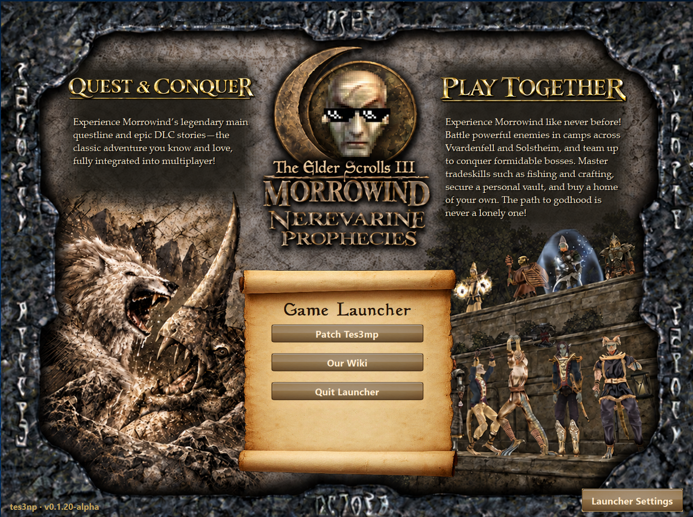

# tes3np

**tes3np** is a work-in-progress launcher and built-in patcher for the Morrowind server [Nerevarine Prophecies](https://wiki.nerevarineprophecies.com/).

## Features

- **Character Management** — Save up to 10 characters and launch them individually or from a selected default.
- **Automatic Login** — Launch saved characters and automatically enter their login credentials using configurable timing.
- **Crash Recovery** — Automatically relaunch a character if its TES3MP client closes or crashes. Recovery can be enabled or disabled per character.
- **Launch All** — Cycle through multiple saved characters automatically, launching them one at a time in list order.
- **Daily Login Scheduling** — Schedule saved characters for daily login from Manage Characters.
- **Built-in Patcher** — Apply supported Nerevarine Prophecies launcher patches without manually replacing files.
- **Macro Manager** — Import, run, stop, and remove AutoHotkey macros, including supported ZIP macro packages.
- **Portable Character Backups** — Export character and launcher settings to a portable backup and import them on another computer.
- **Automatic Updates** — Check for new tes3np releases and safely download, verify, and install launcher updates.
- **Nerevarine Prophecies Wiki Access** — Open the [Nerevarine Prophecies Wiki](https://wiki.nerevarineprophecies.com/) directly from the launcher.

## Download

Open the [**Releases**](https://github.com/IAmShawn98/tes3np-releases/releases) page and download the latest versioned Windows ZIP:

`tes3np-v0.1.17-alpha-windows.zip`

Example: `tes3np-v0.1.17-alpha-windows.zip`

Files named `tes3np-windows.zip`, `tes3np-windows.zip.sha256`, and `tes3np-update.json` are used by the automatic updater. For a manual installation, download the versioned Windows ZIP.

## Requirements

- [Morrowind Game of the Year Edition](https://en.uesp.net/wiki/Morrowind:Morrowind)
- [TES3MP 0.8.1 Win64](https://github.com/TES3MP/TES3MP/releases/tag/tes3mp-0.8.1)
- Windows

## Install

1. Download the latest `tes3np-v0.1.17-alpha-windows.zip` from [**Releases**](https://github.com/IAmShawn98/tes3np-releases/releases).
2. Extract the ZIP.
3. Move the extracted `tes3np` folder into your TES3MP 0.8.1 Win64 folder.
4. Do not move or remove individual files from the `tes3np` folder.
5. Run `tes3np.exe`.

## Update

When a newer version is available, tes3np can download, verify, and install the update from the launcher.

For a manual update, download the newest versioned Windows ZIP from [**Releases**](https://github.com/IAmShawn98/tes3np-releases/releases), extract it, and replace your existing tes3np installation with the new version.

## Release Channels

- **Alpha:** Early releases under active development.
- **Beta:** More complete releases undergoing final testing.
- **Stable:** General releases recommended for normal use.

## Troubleshooting

If the launcher reports an error, copy the relevant log from **AppData Settings** or take a screenshot of the error message and include it when reporting the problem.
